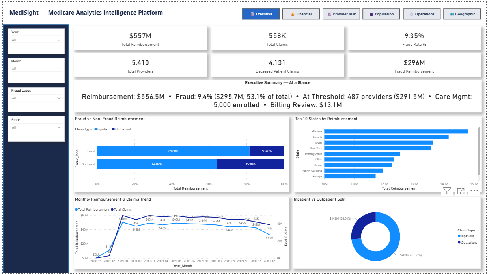
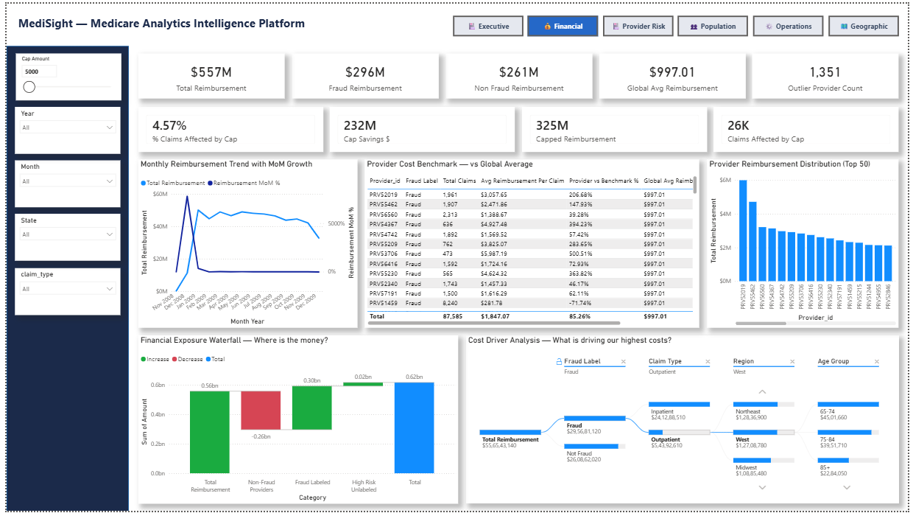
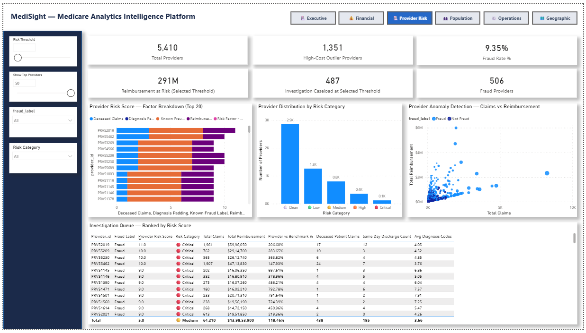
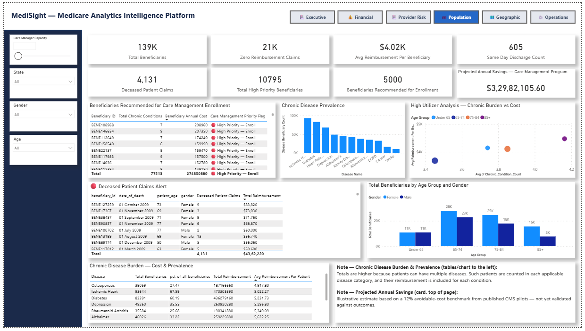
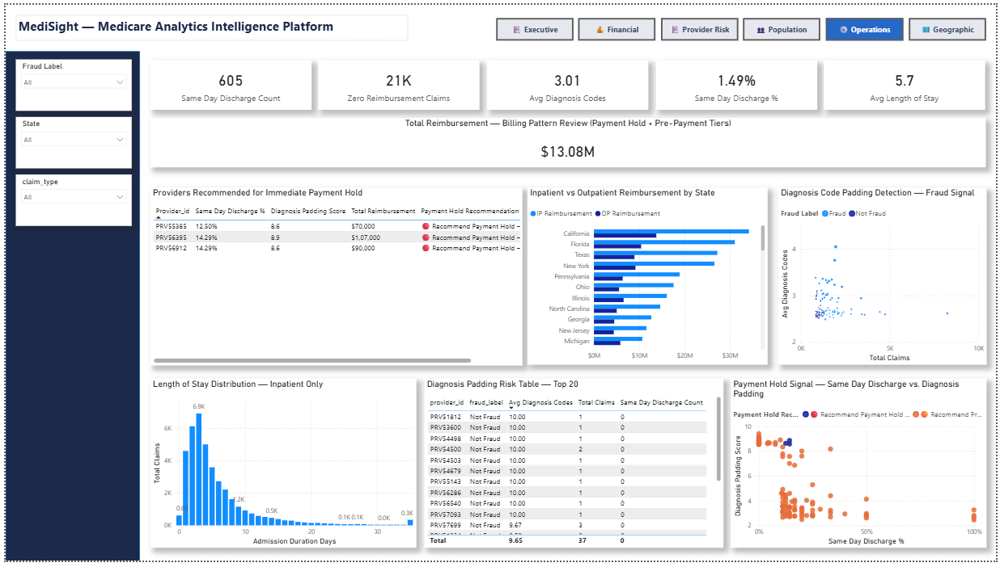

# MediSight — Medicare Fraud & Program Integrity Analytics

**A business decision tool, not a reporting dashboard.** Built on CMS's public Medicare claims dataset, MediSight identifies fraud risk, explains it, and drives real operational decisions — reimbursement policy, investigation prioritization, payment holds, and care management enrollment — through interactive, data-verified tools across a full Python → SQL Server → Power BI pipeline.

   

---

## Table of Contents
- [Overview](#overview)
- [Why This Project Is Different](#why-this-project-is-different)
- [Architecture](#architecture)
- [Dataset](#dataset)
- [Dashboard Pages & Key Features](#dashboard-pages--key-features)
- [Screenshots](#screenshots)
- [Technologies Used](#technologies-used)
- [Project Structure](#project-structure)
- [Setup Instructions](#setup-instructions)
- [Key Technical Decisions](#key-technical-decisions)
- [Future Enhancements](#future-enhancements)
- [Documentation](#documentation)
- [Author](#author)

---

## Overview

MediSight is an end-to-end Medicare fraud analytics platform built for **CMS (Centers for Medicare & Medicaid Services)** — the U.S. federal agency that directly pays hospitals, doctors, and clinics under Medicare's fee-for-service program.

Most fraud dashboards describe what already happened. MediSight goes one step further: **five of its six main pages contain at least one interactive feature that produces a direct, actionable output** — not just a chart to interpret, but a real decision a specific job role can act on immediately.

| Page | Real decision it drives | Who uses it |
|---|---|---|
| Financial Intelligence | What reimbursement cap policy to adopt | Finance & actuarial staff |
| Provider Risk Intelligence | Who to investigate, sized to real team capacity | Fraud investigators (UPICs) |
| Operational Efficiency | Which providers to stop paying, right now | Clinical/compliance auditors |
| Population Health | Who gets enrolled in care management, given staffing limits | Care management teams |
| Geographic & Trends | Where fraud and spend are concentrated | Regional directors |
| Executive Command Center | Auto-generated summary pointing to the above | CMS leadership |

---

## Why This Project Is Different

- **Every major fraud signal is independently validated against real data**, not assumed correct. The composite Provider Risk Score, for example, was checked against known fraud labels: **100% of "Critical" tier providers and 97.8% of "High" tier providers are confirmed fraud cases** — proof the scoring model actually works, not just a plausible-looking formula.
- **Interactive what-if tools, not static numbers.** A reimbursement cap slider shows, live, that capping payouts at $20,000 saves **$60.3 million (0.71% of claims affected)** — the exact kind of number a policy proposal needs, testable at any cap level in real time.
- **Grounded in real CMS regulatory practice.** The Payment Hold feature mirrors CMS's actual payment suspension authority (42 CFR § 405.370–378) for providers with a credible allegation of fraud — not an invented concept.
- **Built with a genuine engineering decision trail.** Bronze-layer ingestion was originally attempted via SQL Server's native BULK INSERT, then via the SSMS Import Wizard — both abandoned due to inconsistent CSV quoting in the source files — before landing on a validated Python pipeline. That history is preserved in `sql/archive/`.

---

## Architecture

```
Raw CMS CSVs
     │
     ▼
┌─────────────────────┐
│   Python (Bronze)    │  reader → profiler → validator → writer
│   6-check quality gate, full audit trail
└─────────────────────┘
     │
     ▼
┌─────────────────────┐
│  SQL Server (Silver)  │  Cleaning, standardization, derived fraud signals
└─────────────────────┘
     │
     ▼
┌─────────────────────┐
│  SQL Server (Gold)    │  Star schema: fact_claims + 4 dimensions + aggregates
└─────────────────────┘
     │
     ▼
┌─────────────────────┐
│      Power BI         │  57 DAX measures, 8 pages, interactive decision tools
└─────────────────────┘
```

**Medallion architecture** throughout — Bronze (raw, untouched), Silver (cleaned, validated), Gold (business-ready star schema) — with independent validation scripts at every layer.

---

## Dataset

**Source:** CMS Medicare Provider Fraud Detection dataset (public) — see [`data/README.md`](data/README.md) for the download link.

| Metric | Value |
|---|---|
| Period covered | November 2008 – December 2009 |
| Total claims | 558,211 (40,474 inpatient + 517,737 outpatient) |
| Providers | 5,410 (506 fraud-labeled, 9.35%) |
| Beneficiaries | 138,556 |
| Total reimbursement | $556.5M |
| Fraud-labeled reimbursement | $295.7M (53.1% of total) |

The dataset is not included in this repository (see [What's Not Included](#setup-instructions)) — it's linked, per standard practice for repos built on third-party data.

---

## Dashboard Pages & Key Features

### 1. Executive Command Center
5-second health check for leadership. KPI overview, dynamic alert strip, and an auto-generated Smart Narrative summarizing the most urgent findings from every other page.

### 2. Financial Intelligence
**Interactive reimbursement cap calculator** — drag a slider ($5K–$50K) and see live savings, claims affected, and resulting total reimbursement. Also includes a click-through decomposition tree for self-service root-cause analysis of cost drivers.

### 3. Provider Risk Intelligence
The core fraud-detection page. A **5-factor composite Provider Risk Score** (reimbursement anomaly, deceased-patient claims, same-day discharge rate, diagnosis code padding, known fraud label) ranks and explains every provider's risk — broken down visually so every flag is defensible, not a black box. An adjustable **Risk Threshold slider** lets investigation teams size their caseload to real capacity, showing both provider count and dollar exposure at any chosen bar.

### 4. Population Health
Identifies beneficiaries who are both medically complex (6+ chronic conditions) and costly enough ($10K+/year) to warrant proactive care management — **10,795 people, verified live against the data**. A capacity slider shows exactly how much of that real need current staffing can actually cover.

### 5. Operational Efficiency
A second, independent fraud lens — billing pattern abuse (same-day discharges, diagnosis code padding) rather than the composite score. Produces a **Payment Hold Recommendation list**, mapped directly to CMS's real payment suspension authority.

### 6. Geographic & Trends
Regional and state-level fraud/spend concentration, with a flexible measure switcher letting one map and chart pair answer six different questions on demand.

---

## Screenshots

| Executive Command Center | Financial Intelligence |
|---|---|
|  |  |

| Provider Risk Intelligence | Population Health |
|---|---|
|  |  |

| Operational Efficiency | Geographic & Trends |
|---|---|
|  |  |

---

## Technologies Used

| Layer | Tools |
|---|---|
| Ingestion | Python (pandas, SQLAlchemy, pyodbc) |
| Data Warehouse | SQL Server (T-SQL, stored procedures) |
| Modeling & Visualization | Power BI Desktop, DAX |
| Architecture Pattern | Medallion (Bronze/Silver/Gold), Star Schema |

---

## Project Structure

```
medisight-fraud-analytics/
├── src/etl/              # Python Bronze ingestion pipeline
├── sql/
│   ├── silver/           # Cleaning & standardization
│   ├── gold/              # Star schema build
│   ├── analytical/       # Ad hoc SQL business-question scripts
│   └── archive/           # Superseded Bronze approach (see its README)
├── powerbi/               # .pbip project, report, semantic model, theme
├── docs/                  # Design specs, DAX documentation, business value doc
├── screenshots/           # Dashboard page captures
└── data/                  # Dataset source link (data not included)
```

---

## Setup Instructions

1. **Clone this repository**
   ```bash
   git clone https://github.com/YOUR_USERNAME/medisight-fraud-analytics.git
   ```
2. **Download the dataset** — see [`data/README.md`](data/README.md) for the source link. Place the 4 CSV files in a local `data/raw/` folder (not tracked by Git).
3. **Configure the pipeline** — update `src/etl/config.py`:
   - `SOURCE_DIR` → your local `data/raw/` path
   - `DB_SERVER` → your SQL Server instance name
4. **Run the Bronze ingestion pipeline**
   ```bash
   python src/etl/main.py
   ```
5. **Run the SQL layers in order** (SSMS or Azure Data Studio):
   - `sql/silver/04_silver_validation_profiling.sql` through `07_silver_validation.sql`
   - `sql/gold/08_gold_create_tables.sql` through `10_gold_validation.sql`
6. **Open the Power BI project** — `powerbi/medisight.pbip` in Power BI Desktop. Update the data source connection to point at your SQL Server instance.

---

## Key Technical Decisions

- **Python over BULK INSERT for Bronze ingestion** — source CSVs had inconsistent quoting that broke SQL Server's native loaders; Python's `pandas` handled it reliably with full validation and audit lineage (`ingestion_timestamp`, `source_file_name`, `batch_id` on every row).
- **No physical foreign keys in the Gold fact table** — deliberate, to keep truncate/reload pipeline runs simple. Referential integrity is enforced upstream during Silver validation instead.
- **Disconnected parameter tables for what-if analysis** — the Cap Amount, Risk Threshold, and Care Manager Capacity sliders are all built on Power BI's What-if Parameter pattern, letting users test scenarios without writing DAX or waiting on a new report.
- **Independent SQL validation alongside DAX** — every headline dashboard number (fraud rate, cap savings, regional benchmarks) was independently recomputed in raw SQL and cross-checked against the live Power BI model before being trusted.

---

## Future Enhancements

- Auditor allocation tool for the Geographic & Trends page — proportional staffing recommendations by regional fraud exposure share
- Case status tracking for the Investigation Queue (open/under review/cleared), to turn repeated flags into a true working queue
- Projected cost-savings estimate for the care management program, calibrated against real program outcomes rather than a published industry benchmark
- Row-level security design for a production deployment handling real (non-public) PHI data

---

## Documentation

Full page-by-page and visual-by-visual documentation is available in [`docs/MediSight_Dashboard_Documentation.docx`](docs/MediSight_Dashboard_Documentation.docx), covering every KPI, chart, table, and slicer across all eight pages with its business purpose explained in detail.

Additional design and technical documentation in [`docs/`](docs/):
- `PowerBI_Design_Specification.md`
- `DAX_DataModel_Performance_Documentation.md`
- `Business_Value_and_Real_World_Impact.md`
- `Enterprise_UIUX_Design_Standard.md`

---

## Author

**Chandramouli Logisa**
[https://www.linkedin.com/in/chandramoulilogisa/] · [chandramouli17333@gmail.com]

---

*This project uses publicly available CMS data and is built for portfolio and educational purposes. It is not affiliated with or endorsed by CMS.*
